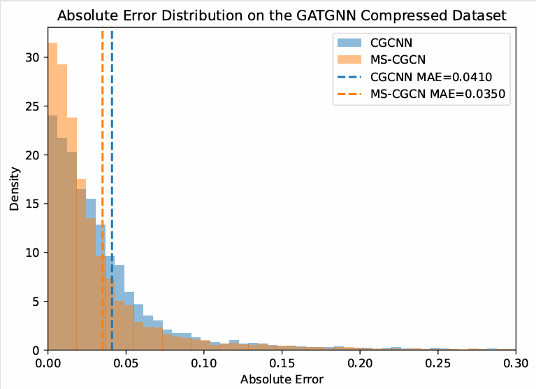

# Multi-Scale CGCNN 
This repository contains a PyTorch Geometric implementation of a **Multi-Scale CGCNN** for crystal property prediction:

## Model Overview

Overall architecture of MS-CGCN, including data processing, multi-scale feature learning, and fusion prediction.

<p align="center">
  
</p>

## PCA Visualization

Figure: PCA visualization of the embeddings learned by MS-CGCN.  
(a) first-scale embedding, (b) second-scale embedding, (c) third-scale embedding, and (d) combined embedding of all three scales.  
The color bar represents the formation energy.

<p align="center">
  
</p>

## Absolute Error Distribution
Absolute-error distribution of CGCNN and MS-CGCN on the GATGNN compressed dataset.  
MS-CGCN shifts more samples into the low-error region and achieves a smaller MAE.
<p align="center">
  
</p>

- **CIF -> Graph** conversion with:
  - Gaussian distance expansion (50 dims)
  - Scaled direction vector features (3 dims)
  - `edge_dist` saved separately for learnable radius-range gating
- **Per-scale CGCNN** encoders with optional learnable radius-range gate
- **Cross-scale attention** (keys-only masking) + **per-sample scale fusion**
- Simple training script with train/val/test split and curve plotting

## Project layout

```
.
├─ scripts/
│  └─ train_ms.py
├─ model/
│  ├─ cgcnn_gate.py
│  └─ MS_CGCN.py
├─ data/
│  ├─ data_preproc.py
│  └─ CIFGraphDatasetCached.py
└─ results/   (outputs; gitignored)
```

## Install

Create an environment and install dependencies:

```bash
pip install -r requirements.txt
```

## Data format

Prepare a dataset folder with:

```
DATA_ROOT/
├─ cif/                     # *.cif files
├─ id_prop.csv              # two columns: id,target (no header)
└─ init_weights/regression/
   └─ atom_init.json        # element feature vectors keyed by atomic number
```

## Train

Run training (paths are configurable):

```bash
python scripts/train_ms.py \
  --root DATA_ROOT \
  --cif_dir DATA_ROOT/cif \
  --csv_path DATA_ROOT/id_prop.csv \
  --element_json DATA_ROOT/init_weights/regression/atom_init.json \
  --save_dir results
```

To see all options:

```bash
python scripts/train_ms.py --help
```

## Notes

- The cached dataset will be stored under `--root/processed/` as a `.pt` file.
- Output curves are saved to `--save_dir`.

